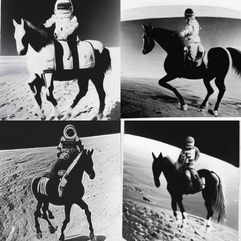

# Tensorflow2 Implementation of Latent Diffusion Model (LDM)

This is a TensorFlow2 implementation (tested on version 2.13.0) of **Latent Diffusion Model** ([paper](https://arxiv.org/abs/2112.10752) and [official PyTorch implementation](https://github.com/CompVis/latent-diffusion))


## Quick start

Clone this repo
```bash
git clone git@github.com:chao-ji/ldm_tf2.git
```

And install the required python libraries.

```bash
pip install -r requirements.txt
```
Note that the only thing needed (other than tensorflow) is the library [transformers](https://pypi.org/project/transformers/) by [HuggingFace](https://huggingface.co/), which is used to tokenize text prompts.


### Convert pretrained model to TF2 format

The [official PyTorch implementation](https://github.com/CompVis/latent-diffusion) comes with [pretrained txt2img model](https://ommer-lab.com/files/latent-diffusion/text2img.zip). 

First you need to download and unzip it, and convert it into TF2 format:

```bash
python convert_ckpt_pytorch_to_tf2.py --pytorch_ckpt_path model.ckpt
```

You will get three TF2 checkpoints `transformer-1.data-00000-of-00001`, `transformer-1.index`, `unet-1.data-00000-of-00001`, `unet-1.index`, `autoencoder-1.data-00000-of-00001`, `autoencoder-1.index`.

This is a model of ~1.5B parameters (~0.54B for transformer, ~0.87B for unet, and ~0.09B for the KL-regularized autoencoder)

### Sampling
Now is the time to generate images with text prompt!

Note that all the configurations (for either training or sampling) can be set in [all_in_one_config.yaml](all_in_one_config.yaml)

First make sure that all the checkpoint files for `transformer-1`, `unet-1`, and `autoencoder-1` are correctly set under `pre_ckpt_paths`.

```yaml
pre_ckpt_paths:
  cond_stage_model: transformer-1
  unet: unet-1
  autoencoder: autoencoder-1
```

The specific parameters for controling the sampling process can be found under `ldm_sampling`:

```yaml
ldm_sampling:
  # scale for classifier free guidance
  guidance_scale: 5.

  # shape of the latent variable in [batch_size, height, width, latent_channels]
  # the shape of the final generated image is `height * 8` by `width * 8`  
  # `batch_size` in `latent_shape` is just the number of images to be generated in one batch
  latent_shape: [4, 32, 32, 4]

  # whetehr to save intermediate results for estimated `x_{t-1}` and `x_{0}`
  sample_save_progress: false

  text_prompt: "a virus monster is playing guitar, oil on canvas"

  vocab_dir: bert_model # directory where the `vocab.txt` file is located

  autoencoder_type: "kl" # ["kl", "vq"]
```
Note `guidance_scale` is the hyperparameter proposed in [classifier-free diffusion guidance](https://openreview.net/pdf?id=qw8AKxfYbI) to control the mode-coverage vs. fidelity tradeoff. Larger values indicate less diversity but high quality.

Also the parameters `eta` and `num_ddim_steps` (proposed in [DDIM](https://arxiv.org/abs/2010.02502)) under `ldm` may also have an impact on the quality of the generated images, where `eta` (float between 0 and 1 ) controls the level of variance in the reverse (i.e. generative) process, and `num_ddim_steps` (<= 1000, i.e. the DDPM steps) is the length of the subsequence of DDPM steps. Consider setting them to large values like the following

```yaml
ldm:
  num_steps: 1000
  beta_start: 0.00085
  beta_end: 0.012
  v_posterior: 0.
  scale_factor: 0.18215
  eta: 1.
  num_ddim_steps: 200
```

To sample, just run
```bash
python run_ldm_sampler.py --config_path all_in_one_config.yaml
```

The generated images are in the form of numpy arrays (with shape `[N,H,W,C]`) and are saved to `.npy` files.

## Training
Training of latent diffusion model is divided into two stages:
* Train an autoencoder, which has an **encoder** that encodes image in pixel space to latent space, and a **decoder** that decodes latent variable back to image space.
* Train diffusion model (conditioned on text) on the encoder of a pretrained autoencoder.

### Convert raw data to TFRecord files

[run_tfrecord_converters.py](run_tfrecord_converters.py) is an example that shows how to generate tfrecord files from raw data. Functions `convert_images_to_tfrecord` and `convert_coco_captions_to_tfrecord` in [dataset.py](dataset.py) handles the conversion of "image only" dataset and "image-caption pair" dataset, which are used to train autoencoders and latent diffusion models, respectively. Modify the parameters in [run_tfrecord_converters.py](run_tfrecord_converters.py) for your own case.

During training, the serialized images (and captions) in TFRecord files will be loaded and deserialized, and then padded and resized into tensors of shape `[batch_size, image_height, image_width, 3]` (and `[batch_size, max_seq_length]` for captions)
 
### Autoencoders
Set the parameters in [all_in_one_config.yaml](all_in_one_config.yaml) controling autoencoder training:

```yaml
autoencoder_training:
  # directory where pre-converted "*.tfrecord" files are located
  root_path: /path/to/tfrecord/images 
  params:
    batch_size: 4
    image_size: 256
    keys: ["image"]   # ["image"] for training autoencoders, and ["image", "caption"] for txt2img latent diffusion model
  autoencoder_type: "vq" # ["kl", "vq"]
  ckpt_path: "aevq" # ["aekl", "aevq"], prefix of the ckpt files in which a trained model will be saved
  num_iterations: 500000  # num of training iterations

lpips_ckpt_path: lpips.ckpt-1
```

Note that training the autoencoder involves computing the **perceptual loss** using a pretrained LPIPS (Learned Perceptual Image Patch Similarity) module ([paper](https://arxiv.org/abs/1801.03924)). The pretrained checkpoint `lpips.ckpt-1` can be downloaded from this [link](https://drive.google.com/drive/folders/196RYpMQx-mvrGt81SgJmVjaA9XmD4I5c?usp=drive_link).

Run the following command to start training autoencoders:
```bash
python run_autoencoder_trainer.py --config_path all_in_one_config.yaml
```

### Latent Diffusion Model

Parameters in [all_in_one_config.yaml](all_in_one_config.yaml) controling ldm training:

```yaml
ldm_training:
  root_path: /path/to/tfrecord/images_captions
  params:
    batch_size: 1
    image_size: 256
    flip: false
    keys: ["image", "caption"]  # ["image"] for training autoencoders, and ["image", "caption"] for txt2img latent diffusion model
  autoencoder_type: "kl" # ["kl", "vq"]
  ckpt_path: "ldm"
  num_iterations: 500000
  train_cond_model: false
```

Again run the following to start training ldm:

```bash
python run_ldm_trainer.py --config_path all_in_one_config.yaml
```

## Results

### Sampled images
<p align="center">
  
  
  <br>
  "A corgi wearing a bowtie and a birthday hat", "A photograph of an astronaut riding a horse"
</p>

<p align="center">
  
  
  <br>
  "A happy bear reading a newspaper, oil on canvas", "A street sign that reads "Latent Diffusion"" 
</p>

[More samples](samples)

### Reconstructed Images

Samples of reconstructed images in CelebAHQ dataset by Autoencoders (KL-regularized)

<p align="center">
  
  <br>
  Original 
</p>

<p align="center">
  
  <br>
  Reconstruction
</p>
